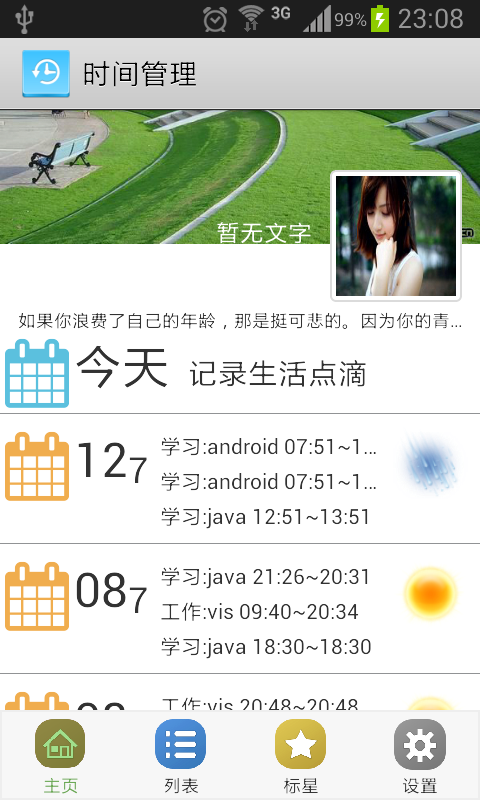
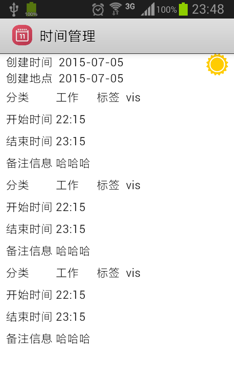
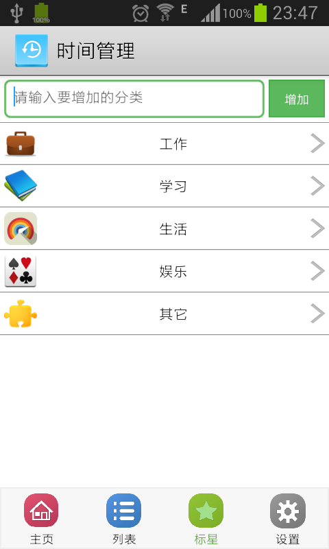

#TimeManager

## 作用
- 管理时间
- 记录每天某个时间段所做的事
- 可以备份所有日记

## 功能页介绍
- 整体框架
    + 利用fragment+viewpager
- 首页
    + listview(注意上下拉到时会去刷新屏幕，空的要置空)

- 新增日记页
    + 利用actionbar--menu菜单
    + 注意activity之间的通信

- 详情日记页
    + 利用actionbar--menu菜单
    + 注意activity之间的通信

- 编辑日记页
    + 利用actionbar--menu菜单
    + 注意activity之间的通信

- 标签管理页
    + 系统默认的一些标签
    + 自己可以增加一些标签
    
